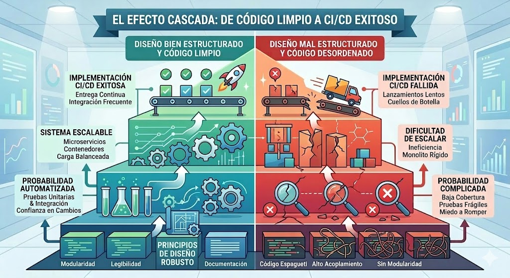
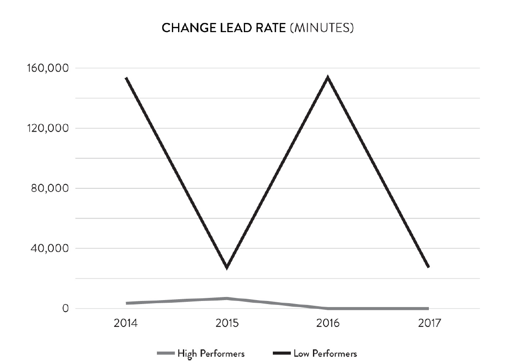
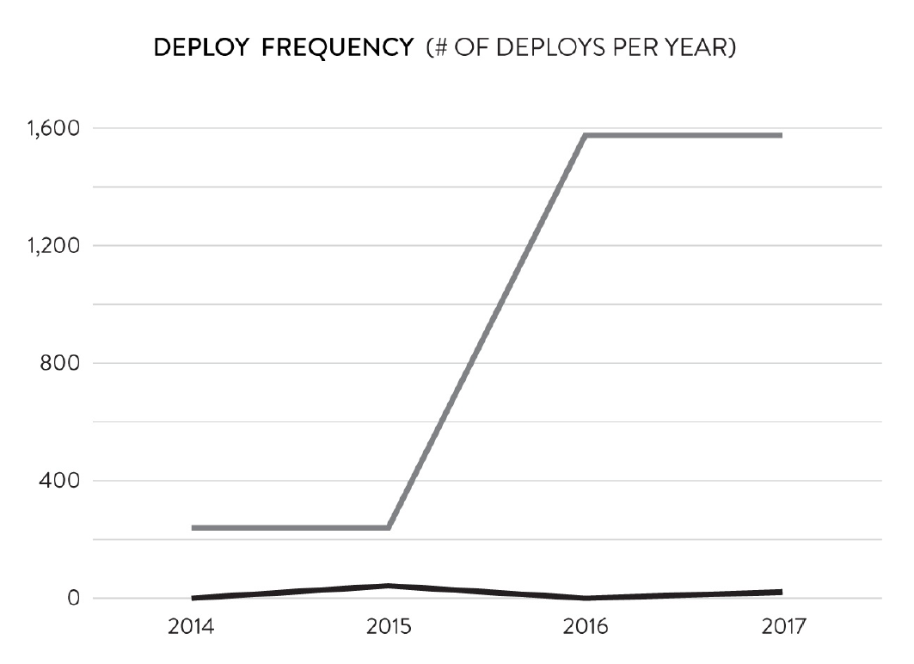
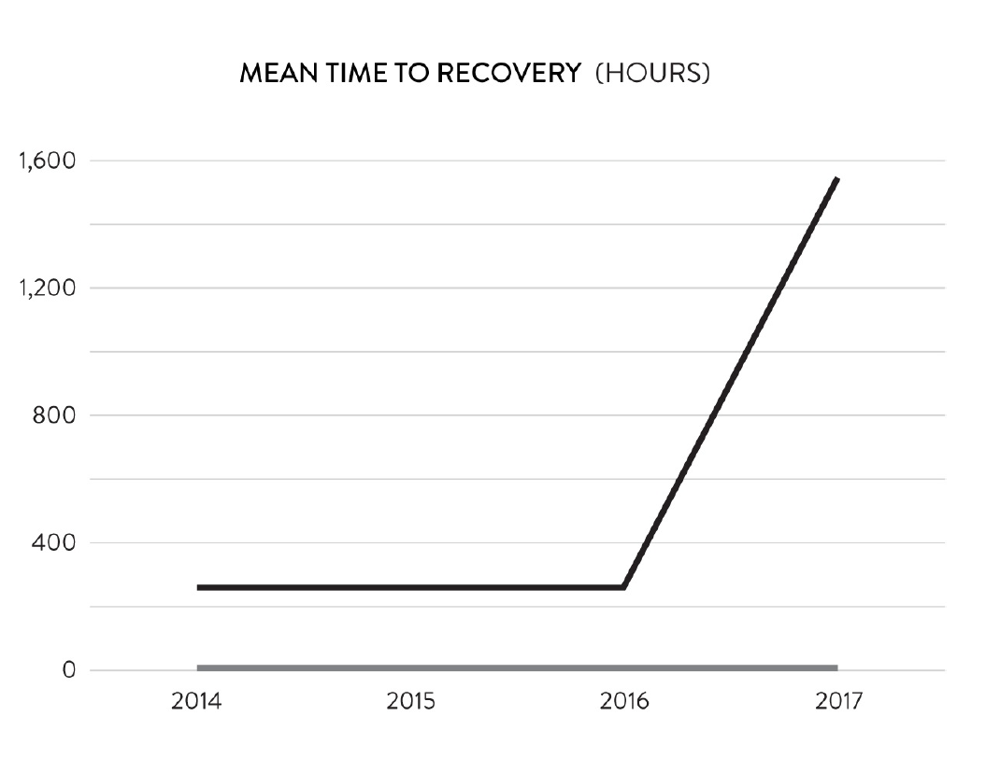
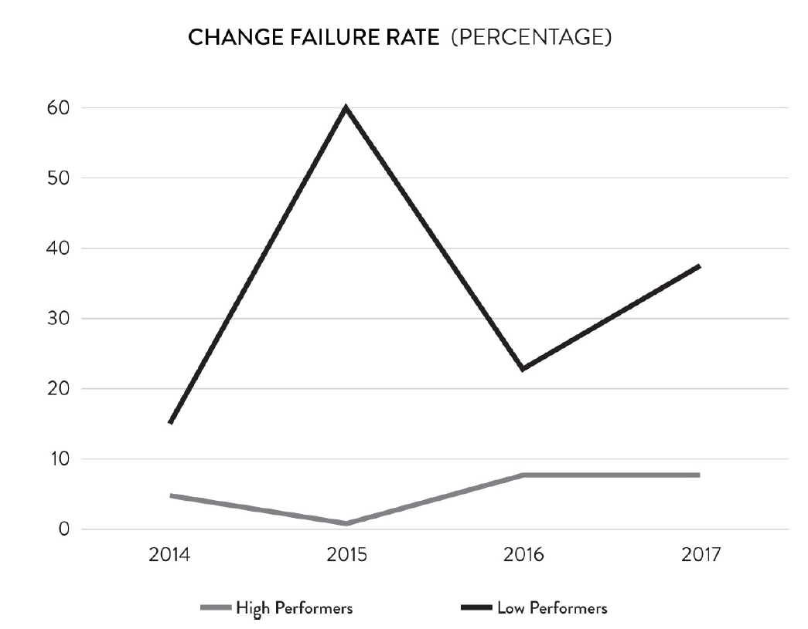
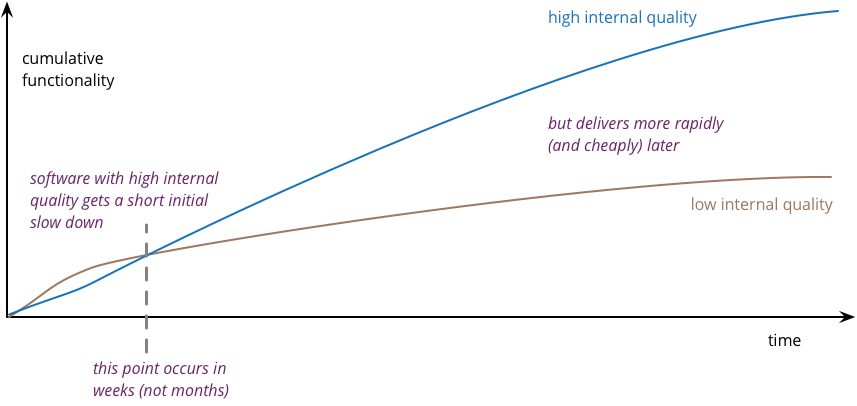
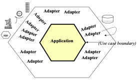

# Integración y entrega continua

## Estructura del curso

#### Finalidad: ¿Para qué?

- reducir el costo, el tiempo y el riesgo del cambio;
- mantener el software en estado liberable;
- acortar el ciclo entre cambio y feedback;
- aumentar la capacidad de recuperación ante fallas;
- y hacer que la entrega sea una capacidad organizacional estable, no un evento excepcional.

El propósito de estas prácticas es mantener el sistema en un estado permanentemente integrable, verificable y liberable, de modo que la puesta en producción pueda realizarse bajo demanda y no quede condicionada por tareas técnicas pendientes, por deuda operativa acumulada o por procesos de estabilización prolongados. La idea de fondo no es simplemente **automatizar despliegues**, sino transformar la entrega de software en una capacidad estable del sistema. Esto implica que cada cambio, desde etapas tempranas, atraviese mecanismos que permitan integrarlo, validarlo y promoverlo con evidencia suficiente sobre su corrección y su impacto probable.

La mejora del delivery solo es significativa si combina rapidez y estabilidad. Liberar más veces sin reducir la tasa de fallas o sin mejorar la capacidad de recuperación no constituye madurez de delivery, sino aceleración del desorden. Por eso, la finalidad de CI/CD debe formularse en términos más amplios: 
- disminuir el tiempo entre la producción de un cambio y su validación en condiciones reales;
- reducir el riesgo asociado a la integración y al release;
- aumentar la visibilidad del proceso de entrega;
- y fortalecer la capacidad de recuperación cuando un cambio introduce una degradación o un incidente.

La entrega continua, entendida de este modo, no es un mecanismo accesorio del desarrollo, sino una condición para que el software pueda evolucionar sin que cada modificación amenace la estabilidad del sistema completo.

#### Fundamentos: ¿Por qué?

- la integración tardía incrementa el costo del error;
- los lotes grandes acumulan incertidumbre;
- los procesos manuales aumentan variabilidad e imprevisibilidad;
- el feedback tardío vuelve más costosa la corrección;
- la falta de recuperación rápida eleva el impacto de las fallas.

El concepto de tamaño de lote adquiere centralidad. Cuanto mayor es el lote de cambios que se integra o despliega: - - mayor es la complejidad cognitiva para comprenderlo,
- mayor es la dificultad de revisar sus efectos,
- mayor es el costo de localizar la causa de una falla
- y mayor es la incertidumbre acumulada antes de obtener feedback.

La reducción del tamaño de lote no es, por tanto, un principio de estilo, sino:
- una manera de disminuir variabilidad,
- acelerar la detección de errores
- y reducir el costo de corrección.

El flujo de trabajo que favorece CI/CD es, en consecuencia, un flujo con cambios pequeños, integración frecuente y baja acumulación de trabajo parcialmente terminado.

Los errores de integración, compatibilidad, comportamiento funcional o impacto no funcional suelen volverse más costosos cuanto más tarde se detectan. Por eso, la estrategia de entrega continua insiste en construir mecanismos automáticos de validación que permitan detectar rápidamente cuándo un cambio introduce una regresión, viola una restricción o reduce la capacidad operativa del sistema.

#### Mecanismos: ¿Cómo?

La integración y el despliegue continuo no se realizan mediante una única técnica ni por medio de una sola herramienta, sino a través de un conjunto articulado de prácticas, decisiones de arquitectura y mecanismos operativos. Estos mecanismos tienen como finalidad:
- volver posible la integración frecuente,
- la validación temprana,
- la liberación segura
- y la recuperación rápida ante fallas.

Algunos ejemplos:
- integración continua;
- control de versiones;
- estrategias de pruebas automatizadas;
- implementación de pipelines;
- uso de artefactos;
- automatización del despliegue;
- gestión de cambios de base de datos;
- estrategias de release;
- feature flags;
- observabilidad y monitoreo;
- métricas de desempeño de delivery.

#### Material

- [Continuous Delivery](https://martinfowler.com/books/continuousDelivery.html)
- [Accelerate](https://www.amazon.com/Accelerate-Software-Performing-Technology-Organizations/dp/1942788339)
- [Proyecto Liga Libre](https://github.com/emigallo-edu/liga-libre)


#### Conocimiento necesario

- [Master - Diseño OO](https://escuela.it/cursos/curso-de-diseno-orientado-a-objetos/estudiar)
- [Master - Arquitecturas](https://escuela.it/cursos/curso-arquitecturas-software-agiles-pesadas/estudiar)
- [Master - Pruebas](https://escuela.it/cursos/pruebas-software/estudiar)

--------

# Introducción

#### Objetivos de la práctica

>Nuestro objetivo es hacer que la entrega de software desde las manos de los desarrolladores hasta la producción sea un proceso confiable, predecible, visible y en gran medida automatizado con riesgos cuantificables y bien comprendidos.
>
>Continuous Delivery - Jez Humble & David Farley

No se trata de “desplegar más seguido” como fin en sí mismo, sino hacer que la entrega de software sea repetible, confiable y de bajo riesgo.

La estrategia busca que una organización pueda:
- poner cambios en producción en cualquier momento, si el negocio lo decide;
- reducir el riesgo del release, evitando despliegues traumáticos, manuales y llenos de incertidumbre;
- acortar el tiempo entre una idea y su validación real, obteniendo feedback antes;
- mejorar la calidad, porque cada cambio pasa continuamente por build, pruebas y validaciones;
- hacer del release una actividad rutinaria, y no un evento excepcional.

El objetivo de Continuous Delivery es mantener el software siempre en un estado desplegable, de modo que liberarlo a producción sea una decisión de negocio y no una limitación técnica.

No significa que todo se publique automáticamente, sino que el equipo no quede frenado porque “todavía falta estabilizar”, “hay que correr scripts manuales” o “nadie sabe si esto va a romper”.

>La entrega continua es una disciplina de desarrollo de software que consiste en crear software de forma que pueda implementarse en producción en cualquier momento.
>
>Se aplica la entrega continua cuando:
>
>- El software es desplegable durante todo su ciclo de vida.
>- El equipo prioriza la disponibilidad del software sobre el desarrollo de nuevas funcionalidades.
>- Cualquier persona puede obtener retroalimentación rápida y automatizada sobre la preparación para producción de sus sistemas cada vez que se realiza un cambio.
>- Se pueden realizar implementaciones automáticas de cualquier versión del software en cualquier entorno, bajo demanda.
>
>[Martin Fowler](https://martinfowler.com/bliki/ContinuousDelivery.html)

#### ¿Qué problemas resuelve?

CI/CD existe para reducir el costo y el riesgo del cambio. No para “automatizar por automatizar”, no para verse modernos, y tampoco para desplegar más veces porque sí. El problema de fondo es que, cuando los cambios se acumulan durante mucho tiempo, se vuelven más difíciles de integrar, más difíciles de probar, más difíciles de explicar y más costosos de revertir.

Tres conceptos que van a atravesar todo el curso:
- **Lote** de cambio: cuántas modificaciones acumulamos antes de integrar o desplegar.
- **Feedback**: cuánto tarda el sistema en decirnos si lo que hicimos está bien o mal.
- **Riesgo**: cuánta incertidumbre acumulamos antes de enterarnos de que hay un problema.

La relación entre estos tres conceptos es directa. Cuanto más grande el lote, más tarde llega el feedback. Cuanto más tarde llega el feedback, más caro resulta entender qué pasó. Y cuanto más caro es entenderlo, mayor es el riesgo operativo y de negocio.

#### Diferencia entre Integración, Entrega y Despliegue Continuo

Integración continua es la práctica de integrar frecuentemente en una línea principal compartida, validando cada integración con build y pruebas automáticas. Su objetivo no es desplegar, sino evitar que la integración sea un evento tardío, traumático y costoso.

Entrega continua toma esa base y la extiende. No alcanza con integrar seguido: además hay que asegurar que el sistema quede siempre en un estado liberable. Eso significa que cualquier cambio aceptado por el pipeline podría, en principio, llegar a producción de manera rutinaria. La palabra importante es “liberable”. No significa que todo se publique automáticamente, sino que la decisión de release deja de depender de trabajos técnicos pendientes.

Despliegue continuo, es un caso más extremo: todo cambio que pasa satisfactoriamente por el pipeline se despliega automáticamente a producción. Se puede efectuar Entrega Continua sin hacer Despliegue Continuo.

#### El pipeline de despliegue como sistema

No es una cadena de tareas, sino la representación ejecutable del proceso de entrega. Cada etapa del pipeline responde una pregunta distinta sobre el cambio:

1. ¿compila y se integra?
2. ¿rompe comportamiento esperado?
3. ¿cumple restricciones no funcionales?
4. ¿puede desplegarse con seguridad?
5. ¿está listo para ser promovido?

Lo importante es que el pipeline cumple una doble función. Por un lado, da feedback técnico temprano. Por otro, hace visible y trazable el proceso de entrega. El pipeline, en ese sentido, no es solo automatización: es una forma de hacer explícito qué evidencia exigimos antes de confiar en un cambio. *Continuous Delivery* lo presenta como “Anatomy of the Deployment Pipeline”: como el mecanismo central que estructura la entrega de software.

#### Métricas de Accelerate

Accelerate es un libro de síntesis y divulgación académicamente fundamentada que presenta resultados de investigación empírica sobre desempeño en entrega de software y sobre las capacidades técnicas y organizacionales asociadas a equipos de alto rendimiento.

Es un libro que busca responder, con base empírica, una pregunta central de la ingeniería de software moderna: cómo medir el desempeño de entrega de software y qué capacidades organizacionales y técnicas lo explican. Su aporte distintivo es que intenta fundamentar estas prácticas mediante investigación cuantitativa y análisis estadístico.

Su tesis central es que el desempeño en la entrega de software sí puede medirse y que, además, se relaciona con el desempeño global de la organización. Para eso, los autores proponen un marco de medición hoy muy conocido: las cuatro métricas de delivery.

###### 1. Deployment Frequency
Mide con qué frecuencia un equipo despliega cambios a producción.
Alta frecuencia suele indicar capacidad de trabajar en cambios pequeños y liberarlos sin demasiado costo operativo.
No mide valor de negocio por sí sola; mide capacidad de entrega.

###### 2. Lead Time for Changes
Mide cuánto tarda un cambio desde que se integra al sistema hasta que llega a producción.
Captura la velocidad real del flujo de entrega.
Obliga a mirar el proceso completo, no solo cuánto tarda “programar”.

###### 3. Change Failure Rate
Mide qué proporción de los cambios desplegados en producción provoca fallas que requieren intervención, como rollback, hotfix o corrección urgente.
Es una métrica de estabilidad.
No pregunta cuántos bugs existen en abstracto, sino cuántos cambios generan problemas operativos reales.

###### 4. Time to Restore Service (MTTR)
Mide cuánto tarda el equipo en restaurar el servicio cuando ocurre una falla o degradación.
Refleja capacidad de recuperación.
No depende solo de “arreglar rápido”, sino también de observabilidad, trazabilidad, tamaño de los cambios y mecanismos de rollback o forward-fix.

Desde el punto de vista conceptual, Accelerate puede leerse como una obra que traduce ideas provenientes de Lean, DevOps y delivery continuo a un lenguaje de capacidades medibles. El libro sostiene que el alto desempeño no depende principalmente de herramientas aisladas, sino de un conjunto coherente de prácticas técnicas, arquitectónicas, organizacionales y culturales, como integración continua, trabajo en lotes pequeños, versionado adecuado, automatización, buena arquitectura, monitoreo y culturas de aprendizaje más generativas.

Estas métricas nos obligan a mirar el delivery como un sistema y no como una suma de tareas aisladas. Dos miden velocidad, dos estabilidad. El objetivo no es elegir entre rapidez y confiabilidad, sino mejorar ambas en conjunto. Accelerate presenta precisamente esa combinación como núcleo de desempeño de delivery.

#### Propiedades deseables
###### 1. Mantener la aplicación siempre liberable

El software debe diseñarse y desarrollarse de modo tal que pueda liberarse a producción en cualquier momento. Eso obliga a pensar el diseño no solo en términos de funcionalidad, sino también de entregabilidad: cambios pequeños, integración frecuente, validación continua y ausencia de trabajo técnico pendiente para poder liberar.

###### 2. Favorecer cambios pequeños e integración frecuente

Los cambios grandes son más difíciles de entender, probar, integrar y revertir. Por eso, un principio de diseño clave es estructurar el sistema y el trabajo de forma que sea posible introducir incrementos pequeños, integrarlos rápidamente a la línea principal y obtener feedback temprano. Esto se relaciona directamente con que estrategía de **branching** vamos a trabajar y con evitar ramas largas como modo normal de trabajo.

###### 3. Diseñar para testabilidad

La testabilidad no aparece como una virtud secundaria, sino como una condición central de entregabilidad. Un sistema apto para *Entrega Continua* debe poder validarse rápida y repetidamente mediante pruebas automatizadas en distintos niveles. Eso implica favorecer diseños con responsabilidades claras, dependencias controladas, facilidad de aislamiento y comportamiento observable. Si un sistema es difícil de probar, también será difícil de integrar y de liberar con confianza.

###### 4. Reducir acoplamiento y gestionar explícitamente dependencias

El acoplamiento excesivo vuelve cada cambio más costoso. Un principio fuerte, entonces, es diseñar sistemas donde las dependencias sean explícitas, trazables y manejables, evitando que un cambio aparentemente local obligue a coordinar múltiples partes del sistema al mismo tiempo. Esto aplica tanto a bibliotecas y componentes como a dependencias entre aplicaciones, servicios y bases de datos.

###### 5. Separar deploy de release

Una aplicación bien diseñada para *Entrega Continua* debería permitir desplegar sin necesariamente exponer inmediatamente toda nueva funcionalidad. Esa separación entre movimiento técnico del software y decisión de negocio sobre su exposición reduce riesgo y facilita cambios más frecuentes. De ahí se desprenden después mecanismos como toggles o estrategias progresivas de release, pero el principio previo es de diseño: no obligar a que cada despliegue implique exposición inmediata e irreversible.

###### 6. Diseñar para compatibilidad evolutiva

Los sistemas que soportan *Entrega Continua* deben evolucionar de forma compatible, evitando cambios destructivos que exijan sincronización perfecta entre todos los componentes. Esto vale para APIs, contratos entre componentes y, de manera muy marcada, para esquemas de base de datos. El principio general es privilegiar cambios aditivos y reversibles frente a cambios abruptos y destructivos.

###### 7. Tratar la configuración, la infraestructura y los datos como parte del sistema

La capacidad de delivery depende también de configuración, infraestructura, scripts de despliegue y base de datos. Por eso, un diseño compatible con *Entrega Continua* debe minimizar dependencias implícitas del entorno, externalizar adecuadamente configuración y hacer que los cambios en esos elementos sean versionables, repetibles y automatizables. En términos de diseño, esto significa evitar aplicaciones que “funcionan solo en un ambiente particular” o que dependen de intervención manual opaca para correr correctamente.

###### 8. Construir binarios/artefactos verdaderamente desplegables

El build debe producir artefactos que puedan copiarse a una máquina correctamente configurada y ejecutarse sin depender de la cadena de desarrollo. Traducido a principio de diseño: el sistema debe empaquetarse de manera que el artefacto producido sea autosuficiente en términos operativos razonables, portable entre ambientes y apto para promoción sin reconstrucciones ad hoc. Esto reduce variabilidad entre entornos y aumenta trazabilidad.

###### 9. Hacer visible el comportamiento del sistema en operación

Un diseño compatible con *Entrega Continua* es que la aplicación debe exponer suficientes señales para verificar si está viva, lista y funcionando razonablemente tras un despliegue. En términos modernos, esto implica diseñar pensando en health, readiness, logging y monitoreo, porque un sistema que no puede observarse tampoco puede recuperarse rápido cuando un cambio falla.

###### 10. Automatizar lo repetible, pero sobre un proceso primero entendido

Automatizar un proceso de entrega que antes fue comprendido, simplificado y modelado. Como principio de diseño organizacional y técnico, esto implica evitar pasos manuales opacos, dependencias tácitas y conocimiento tribal en el proceso de build, test y deploy. Un sistema bien diseñado para *Entrega Continua* presupone repetibilidad.



--------

# ¿Cómo trabajar para integrar y entregar con frecuencia?

En esta sesión se abordan las condiciones que hacen posible la integración continua como práctica sostenida.
Reducir el tamaño de lote, limitar el trabajo en curso y trabajar cerca de la *rama principal de desarrollo* mejoran el flujo de entrega, pero esas prácticas sólo son viables cuando el diseño del software y del sistema tiene determinados atributos. Si el sistema presenta alto acoplamiento, responsabilidades confusas o complejidad innecesaria, incluso cambios pequeños se vuelven costosos de probar, difíciles de integrar y riesgosos de desplegar.

Desde esta perspectiva, la integración continua no depende únicamente de herramientas o de la existencia de un pipeline. También exige determinadas propiedades del software: cambios localizados, dependencias controladas, validación rápida y un costo de cambio razonable.

Un diseño con responsabilidades bien asignadas, bajo acoplamiento, cohesión adecuada y complejidad controlada favorece la construcción de pruebas automatizadas confiables, reduce el impacto colateral de los cambios y facilita una estrategia de ramas cortas e integración temprana.

Cuando el software concentra demasiadas responsabilidades, depende fuertemente de detalles de infraestructura o incorpora abstracciones innecesarias, el trabajo de integración pierde fluidez. Los cambios requieren más coordinación, las pruebas se vuelven más difíciles de construir o mantener, y el feedback automático deja de ser rápido y confiable. En estas condiciones, la integración continua tiende a degradarse en una práctica nominal: existe pipeline, pero no existe verdadera capacidad de integrar con frecuencia y seguridad.

El flujo de trabajo y el diseño del software no son dimensiones separadas. La reducción del tamaño de lote, la limitación del *trabajo en progreso* y el trabajo cercano a *rama principal de desarrollo* necesitan de un diseño que mantenga bajo el costo de cambio. En este marco, los principios de diseño de software funcionan como referencia para evaluar si el sistema está siendo construido de una manera compatible con una estrategia real de integración continua.

### Para ponernos en sintonía cuando hablamos de un correcto diseño

- [Código legible y entendible](https://github.com/emigallo-edu/software-design/blob/main/clean-code/content.md)
- [Programación Orientada a Objetos](https://github.com/emigallo-edu/software-design/blob/main/oop/Content.md)
- [Relaciones entre clases](https://github.com/emigallo-edu/software-design/blob/main/classes-types-relations/content.md)
- [GRASP](https://github.com/emigallo-edu/software-design/blob/main/grasp/content.md)

#### Algunos principios de diseño

- alta cohesión (la 'S' de SOLID)
- abierto-cerrado de Bertrand Meyer (la 'O' de SOLID)
- sustitución de Liskov (la 'L' de SOLID)
- bajo acoplamiento
- diseño suficiente
- sencillez

[Charla abierta de Luis Fernández](https://www.youtube.com/watch?v=vrTfxHcYUnk)

#### Code Smell

Un **code smell** es una indicación superficial que generalmente corresponde a un problema más profundo en el sistema.

Es algo que se detecta rápidamente y con facilidad. Pero no siempre indican un problema: un método de más 15-20 líneas de çodigo nos llama la atención muy rapidamente, pero algunos métodos largos funcionan correctamente.

Los **code smell** no son malos en sí mismos, sino que suelen ser un indicador de un problema, no el problema en sí.

[Fuente](https://martinfowler.com/bliki/CodeSmell.html)

#### Síntomas de un diseño incompatible con integración frecuente

- cambios chicos de negocio que obligan a tocar muchas clases;
- pruebas que requieren demasiada infraestructura;
- conflictos de merge frecuentes sobre los mismos archivos;
- necesidad de coordinar demasiado entre personas para cerrar una tarea;
- miedo a integrar porque “todavía no está todo listo”.

#### Estrategias de branch

> Un lote de cambio pequeño es una unidad de cambio cuyo alcance permite integrarla pronto, probarla con rapidez, aislar sus efectos con claridad y liberarla con bajo riesgo.

Las estrategias de branch no deben analizarse únicamente como una convención de uso de Git, sino como una consecuencia de la forma en que el software está diseñado y del modo en que el equipo organiza su trabajo. En un esquema de *Entrega Continua*, las estrategias que mejor funcionan son aquellas que favorecen integración temprana, ramas de vida corta y cambios pequeños. Sin embargo, esto sólo es viable cuando el sistema permite que distintas personas trabajen en paralelo con un nivel razonable de independencia.

Cuando el software presenta alto acoplamiento, responsabilidades poco claras o una concentración excesiva de lógica en unas pocas clases, el trabajo concurrente se vuelve más difícil. Dos desarrolladores que avanzan sobre tareas conceptualmente distintas terminan modificando los mismos componentes, compitiendo por las mismas clases y generando no sólo conflictos de merge, sino también conflictos semánticos: cambios que técnicamente se integran, pero que alteran o invalidan decisiones tomadas por otra persona. En estas condiciones, las ramas cortas pierden efectividad y la integración frecuente se vuelve costosa.

Por el contrario, un diseño con responsabilidades mejor distribuidas, límites claros entre componentes y dependencias más controladas permite que distintas tareas evolucionen con menor interferencia mutua. Esto hace posible que varios desarrolladores trabajen en paralelo sobre cambios acotados, integren con mayor frecuencia y reduzcan el riesgo asociado a la convergencia tardía. Desde este punto de vista, estrategias como trunk-based development no dependen solamente de disciplina operativa, sino también de un diseño que reduzca el solapamiento innecesario entre cambios.

Así, la discusión sobre estrategias de branch no se limita a elegir entre trunk-based development, ramas por tarea o variantes más cercanas a GitFlow. La cuestión de fondo es si el sistema admite integración frecuente sin que cada cambio arrastre un volumen excesivo de coordinación. Cuando el diseño favorece bajo acoplamiento, cohesión adecuada y cambios localizados, las estrategias de ramas cortas resultan viables y efectivas. Cuando esas condiciones no están presentes, las ramas tienden a alargarse y a funcionar como mecanismo de contención frente a un diseño que dificulta integrar.

En este marco, la estrategia de branch más compatible con *Entrega Continua* es aquella que minimiza el tiempo entre desarrollo e integración. Pero para que eso sea sostenible, el software debe ofrecer condiciones que permitan trabajo concurrente, pruebas rápidas y cambios acotados. De lo contrario, la estrategia elegida en el repositorio no resuelve el problema de fondo, sino que apenas compensa, de manera parcial, limitaciones del diseño.

>Recomendamos que intente confirmar los cambios en el sistema de control de versiones al finalizar cada cambio incremental de refactorización. Si utiliza esta técnica correctamente, debería confirmar los cambios al menos una vez al día, y normalmente varias veces al día.
>
>Continuous Delivery - Jez Humble & David Farley

##### Git Flow


##### Desarrollar en la rama principal

Es una forma extremadamente eficaz de desarrollar, y la única que permite la integración continua.
En este patrón, los desarrolladores casi siempre realizan envíos a la rama principal. Las ramas se utilizan solo en raras ocasiones. Los beneficios de desarrollar en la rama principal incluyen:
- Garantizar la integración continua de todo el código.
- Garantizar que los desarrolladores adopten los cambios de los demás de inmediato.
- Evitar los problemas de fusión e integración al final del proyecto.

##### Realizando cambios complejos sin ramas

Humble y Farley sostienen que los cambios complejos no justifican, por sí solos, abandonar la lógica de integración continua. La respuesta no debería ser “trabajemos semanas aislados en una rama”, sino buscar una estrategia que permita integrar parcialmente sin romper el sistema. Eso implica introducir el cambio por etapas, manteniendo compatibilidad entre el estado viejo y el nuevo durante una transición.

La técnica asociada a esta idea es lo que después se conoce ampliamente como **branch by abstraction**: en vez de ramificar el repositorio, se crea una capa de abstracción o punto de indireccionamiento dentro del diseño, de modo que la implementación vieja y la nueva puedan coexistir durante un tiempo. Así, el equipo puede ir migrando gradualmente llamadas, comportamiento o componentes sin dejar de integrar sobre la rama principal

[Branch by abstraction - Martin Fowler](https://martinfowler.com/bliki/BranchByAbstraction.html?utm_source=chatgpt.com)

Cuando un cambio es demasiado grande para hacerse de una vez, la respuesta no es aislarlo durante mucho tiempo en una rama, sino diseñarlo de manera que pueda introducirse gradualmente sin dejar de integrar y validar el sistema completo.

##### Ship / Show / Ask

###### ¿Pero qué pasa si necesito alguien revise mi código antes de subirlo, no hay mas *Pull Request*?

Ship/Show/Ask es una estrategia de ramificación que combina las características de las solicitudes de extracción con la posibilidad de mantener los cambios publicados. Los cambios se clasifican como:
- Ship (se fusionan con la rama principal sin revisión),
- Show (se abre una solicitud de extracción para su revisión, pero se fusiona con la rama principal inmediatamente)
- o Ask (se abre una solicitud de extracción para su discusión antes de la fusión).

###### Las reglas:
- La revisión del código, o “aprobación”, no debería ser un requisito para que se fusione una solicitud de extracción (Pull Request).
- Los usuarios pueden fusionar sus propias solicitudes de extracción. De esta forma, controlan si su cambio es una “muestra” o una “solicitud”, y pueden decidir cuándo se publica.
- Debemos utilizar todas las excelentes técnicas de integración continua y entrega continua que ayudan a mantener la rama principal lista para su lanzamiento.
- Nuestras ramas no deberían tener una vida útil prolongada, y deberíamos actualizarlas con la rama principal con frecuencia.

--------

# Desempeño en la entrega de software: el enfoque de Accelerate

### Antes de comenzar...

- ¿cómo sabemos si un equipo entrega bien?
- ¿se puede mejorar velocidad sin empeorar estabilidad?

### Presentación del trabajo de investigación

Accelerate se apoya en un trabajo de investigación desarrollado durante cuatro años, iniciado a fines de 2013, con el objetivo de responder una pregunta bastante concreta: qué capacidades y prácticas explican un mejor desempeño en la entrega de software y cómo ese desempeño impacta en los resultados organizacionales. Los autores aclaran que no quisieron basarse solo en anécdotas o casos aislados, sino usar métodos rigurosos, propios de investigación académica, pero llevados al terreno profesional.

Metodológicamente, el estudio se basó en encuestas cuantitativas de corte transversal. A lo largo del programa reunieron más de 23.000 respuestas, provenientes de más de 2.000 organizaciones de distintos tamaños, industrias y contextos tecnológicos: startups, grandes empresas, sectores regulados, entornos legacy y también desarrollos greenfield.

Otro punto importante es que el trabajo fue iterativo. No hicieron una sola encuesta y sacaron conclusiones definitivas. Cada año refinaron el modelo, revalidaron hallazgos previos y ampliaron las preguntas:
- en 2014 buscaron definir y medir software delivery performance, y ver su relación con desempeño organizacional;
- en 2015 profundizaron el efecto de automatización y prácticas Lean;
- en 2016 ampliaron la investigación a seguridad, trunk-based development, test data management y gestión de producto;
- y en 2017 incorporaron arquitectura, liderazgo transformacional y resultados en organizaciones sin fines de lucro.

El valor de Accelerate no está solo en las conclusiones, sino en que intenta demostrar con evidencia empírica, análisis estadístico y una muestra amplia que ciertas capacidades técnicas, culturales y organizacionales se asocian de manera consistente con mejores resultados en software delivery y en desempeño organizacional.

### Resumen general de Accelerate

La tesis central del libro es que el desempeño en entrega de software sí puede medirse de manera rigurosa y que ese desempeño tiene impacto real en el negocio u organización. Se trata de desarrollar capacidades técnicas, organizacionales y culturales que mejoren resultados observables. El libro sostiene además que los equipos de alto desempeño no son exitosos por trabajar más fuerte, sino por trabajar con mejor diseño del sistema de trabajo: lotes más pequeños, automatización, feedback rápido, arquitectura desacoplada, cultura generativa y liderazgo que habilita mejora continua.

>El informe señala que los ejecutivos son especialmente propensos a sobreestimar su progreso en comparación con quienes realmente realizan el trabajo.
>
>Estos hallazgos sobre la discrepancia entre las estimaciones de madurez de DevOps realizadas por ejecutivos y profesionales resaltan dos aspectos que los líderes suelen pasar por alto. Primero, si asumimos que las estimaciones de madurez o capacidades de DevOps de los profesionales son más precisas —porque están más cerca del trabajo—, el potencial de generación de valor y crecimiento dentro de las organizaciones es mucho mayor de lo que los ejecutivos perciben actualmente.
>
>Segundo, esta discrepancia pone de manifiesto la necesidad de medir con precisión las capacidades de DevOps y comunicar los resultados de estas mediciones a los líderes, quienes pueden utilizarlos para tomar decisiones y definir la estrategia sobre la postura tecnológica de su organización.

### Las 4 métricas principales

El aporte más conocido de Accelerate es la definición de cuatro métricas para evaluar **software delivery performance**. El libro las elige porque son métricas de resultado, no de actividad; además obligan a colaborar a desarrollo, operaciones y el resto del sistema, en lugar de optimizar sectores por separado.

#### Lead time for changes

Es el tiempo que pasa desde que el código se commitea hasta que corre exitosamente en producción. Mide la capacidad real de convertir trabajo en valor operativo. Además, un lead time corto no solo permite entregar features antes, sino también corregir incidentes o defectos con rapidez y confianza.

La importancia del tiempo de entrega como métrica es un elemento clave de la teoría **Lean**.
El tiempo de entrega es el tiempo que transcurre desde que un cliente realiza una solicitud hasta que esta se satisface. Sin embargo, en el contexto del desarrollo de productos, donde buscamos satisfacer a múltiples clientes de maneras que quizás no anticipen, el tiempo de entrega se divide en dos partes:
- el tiempo necesario para diseñar y validar un producto o funcionalidad,
- y el tiempo para entregar la funcionalidad a los clientes.

En la fase de diseño, a menudo no está claro cuándo empezar a contar el tiempo, y suele haber una alta variabilidad. En cambio, la fase de entrega —el tiempo que transcurre desde que el trabajo se implementa, prueba y entrega— es más fácil de medir y presenta una menor variabilidad.

>Los plazos de entrega de productos más cortos son mejores, ya que permiten obtener comentarios más rápidos sobre lo que estamos desarrollando y corregir el rumbo con mayor rapidez. Los plazos de entrega cortos también son importantes cuando hay un defecto o una interrupción del servicio y necesitamos ofrecer una solución de forma rápida y con alta fiabilidad.
>
> Accelerate

| Diseño y desarrollo de productos | Entrega de productos (construcción, pruebas, despliegue) |
| ----------- | ----------- |
| Crear nuevos productos y servicios que resuelvan los problemas de los clientes mediante la entrega basada en hipótesis, la experiencia de usuario moderna y el pensamiento de diseño. | Permitir un flujo rápido desde el desarrollo hasta la producción y lanzamientos confiables estandarizando el trabajo y reduciendo la variabilidad y el tamaño de los lotes. |
| El diseño e implementación de funcionalidades puede requerir trabajo nunca antes realizado. | La integración, las pruebas y el despliegue deben realizarse de forma continua y lo más rápido posible. |
| Las estimaciones son muy inciertas. | Los tiempos de ciclo deben ser bien conocidos y predecibles. |
| Los resultados son muy variables. | Los resultados deben tener baja variabilidad. |

##### ¿Qué se preguntó?

La encuesta consitió en medir el tiempo de entrega del producto como el tiempo que transcurre desde que el código se confirma hasta que el código se ejecuta correctamente en producción, ofreciendo las siguientes opciones:
- menos de una hora
- menos de un día
- entre un día y una semana
- entre una semana y un mes
- entre un mes y seis meses
- más de seis meses

#### Deployment frequency

Es la frecuencia con la que el equipo despliega a producción. Cuanto más frecuente es el despliegue, más pequeño suele ser el batch. Eso reduce riesgo, acelera feedback y permite corregir dirección antes. No mide “cuánto produce” un equipo en abstracto, sino cuán seguido convierte cambios en software real disponible para usuarios.

>En el software, el tamaño del lote es difícil de medir y comunicar en diferentes contextos, ya que no existe un inventario visible. Por lo tanto, optamos por la frecuencia de despliegue como indicador del tamaño del lote, ya que es fácil de medir y suele tener baja variabilidad. Por **despliegue** entendemos el despliegue de software en producción o en una tienda de aplicaciones.
>
>Una versión (los cambios que se despliegan) generalmente consta de múltiples confirmaciones de control de versiones, a menos que la organización haya alcanzado un flujo de una sola pieza donde cada confirmación se puede lanzar a producción (una práctica conocida como despliegue continuo).
>
> Accelerate

##### ¿Qué se preguntó?

La encuesta consistió en preguntar a los participantes con qué frecuencia su organización implementa código para el servicio o aplicación principal en la que trabajan, ofreciendo las siguientes opciones:
- bajo demanda (varias implementaciones al día)
- entre una vez por hora y una vez al día
- entre una vez al día y una vez a la semana
- entre una vez a la semana y una vez al mes
- entre una vez al mes y una vez cada seis meses
- menos de una vez cada seis meses

#### Time to restore service

Es el tiempo que tarda la organización en restaurar el servicio cuando ocurre un incidente o degradación. En sistemas modernos, el fallo no desaparece: lo importante no es imaginar que nunca va a ocurrir, sino cuánto tarda el sistema socio-técnico en recuperarse. Esta métrica expresa resiliencia operativa.

Lo importante es que no pregunta solo si el sistema falla, sino qué tan rápido se recupera. Esto la vuelve una métrica que no solo refleja robustez técnica, sino también capacidad de diagnóstico, monitoreo, respuesta operativa y coordinación organizacional.

En Accelerate, la pregunta se formula como cuánto tiempo suele tomar restaurar el servicio para la aplicación o servicio principal cuando ocurre un incidente, como por ejemplo:

- una caída no planificada,
- o una degradación significativa del servicio.

No debe pensarse solo como una métrica de “operaciones” o “soporte”: resume varias capacidades previas del sistema de delivery, entre ellas:
- observabilidad,
- tamaño de los cambios,
- trazabilidad del despliegue,
- facilidad de rollback/fix-forward
- y claridad del ownership.

#### Change failure rate

Es el porcentaje de cambios en producción que terminan generando degradación, incidentes o necesidad de remediación, como rollback, hotfix o patch. Es la métrica de calidad de cambio. Sirve para mostrar si la velocidad está sostenida por calidad o si se está “comprando rapidez” a costa de inestabilidad.

En Accelerate, la pregunta se formula en términos del porcentaje de cambios a producción para la aplicación o servicio principal que:

- degradan el servicio, o
- requieren remediación posterior, como rollback, hotfix, patch o fix-forward.

Esto es metodológicamente importante porque la métrica está anclada en cambios desplegados, no en incidentes aislados ni en defectos encontrados fuera del contexto del release.

Intenta capturar la calidad operativa del cambio. Un equipo puede desplegar mucho y rápido, pero si una proporción alta de esos cambios rompe el sistema o exige remediación, entonces no tiene un delivery maduro. La Change Failure Rate funciona, por lo tanto, como contrapeso de las métricas de velocidad.

Mide específicamente el porcentaje de cambios que terminan mal desde el punto de vista operativo. Por eso es una métrica de estabilidad de delivery, no una teoría total de la calidad del software. Esta distinción está implícita tanto en el libro como en el framing posterior de DORA.

#### Método

El libro parte de esta lógica:

1. Define y mide **software delivery performance** mediante las métricas de delivery.
2. Clasifica a las organizaciones/equipos en niveles de desempeño (high, medium, low performers) según ese desempeño de entrega.
3. Luego estudia cómo ese desempeño se asocia con resultados organizacionales, como performance global, productividad, rentabilidad, cuota de mercado o resultados no comerciales según el tipo de organización.

El estudio agrupa organizaciones según patrones similares de desempeño en métricas de delivery de software y, a partir de esa clasificación, analiza la relación entre ese desempeño y distintos resultados organizacionales.

La clasificación no sale de una norma teórica del tipo: “high performer = tal valor arbitrario”.
Sale de observar que, cuando medís esas variables en una muestra amplia, los equipos tienden a agruparse en patrones de desempeño relativamente diferenciables. DORA describe explícitamente el uso de cluster analysis para segmentar a los equipos y permitir benchmarking entre low, medium, high y, en reportes posteriores, elite performers.

Los valores o rangos que se ven asociados a cada categoría son, en esencia, descripciones de esos clusters. O sea:

- primero agrupan estadísticamente a los equipos según sus resultados en las métricas;
- después describen cómo luce cada grupo en términos de frecuencia de despliegue, lead time, change failure rate y time to restore service.

[Detalle](https://dora.dev/research/2018/dora-report/2018-dora-accelerate-state-of-devops-report.pdf)

En Accelerate y en los reportes DORA, las categorías high, medium y low performers no se definen a priori mediante umbrales arbitrarios. Se derivan empíricamente mediante análisis de clusters sobre las métricas de desempeño de delivery; los rangos asociados a cada categoría describen cómo se comportan esos grupos una vez identificados.

[DORA](https://dora.dev/)

#### Resultados

Se aplicó análisis de cluster durante los cuatro años del proyecto de investigación y se encontró que, cada año, existían categorías significativamente diferentes de rendimiento en la entrega de software en la industria. También se encontraron que las cuatro medidas de rendimiento en la entrega de software son buenos clasificadores y que los grupos que se identificaron en el análisis (alto, medio y bajo rendimiento) presentaban diferencias significativas en las cuatro medidas.

##### Resultados de entrega en 2016

| Métrica | High Performers | Medium Performers | Low Performers |
|-|-|-|-|
| Deployment Frequency | Bajo demanda (múltiples despliegues por día) | Entre una vez semana y una vez mes | Entre una vez al mes y una vez cada seis meses |
| Lead Time for Changes | Menos de una hora | Entre una semana y un mes | Entre un mes y seis meses |
| Time to Restore Service | Menos de una hora | Menos de un día | Menos de un día* |
| Change Failure Rate | 0-15% | 31-45% | 16-30% |

##### Resultados de entrega en 2017

| Métrica | High Performers | Medium Performers | Low Performers |
|-|-|-|-|
| Deployment Frequency | Bajo demanda (múltiples despliegues por día) | Entre una vez semana y una vez mes | Entre una vez semana y una vez mes* |
| Lead Time for Changes | Menos de una hora | Entre una semana y un mes | Entre una semana y un mes* |
| Time to Restore Service | Menos de una hora | Menos de un día | Entre un día y una semana |
| Change Failure Rate | 0-15% | 0-15% | 31-45% |

*Los de bajo rendimiento obtuvieron, en promedio, un resultado inferior (a un nivel estadísticamente significativo), pero tuvieron la misma mediana que los de rendimiento medio.

>Estos resultados demuestran que no existe una disyuntiva entre mejorar el rendimiento y alcanzar mayores niveles de estabilidad y calidad. De hecho, las empresas de alto rendimiento obtienen mejores resultados en todas estas medidas. Esto es precisamente lo que predicen los movimientos Agile y Lean, pero gran parte del dogma en nuestra industria aún se basa en la falsa premisa de que ir más rápido implica sacrificar otros objetivos de rendimiento, en lugar de potenciarlos y reforzarlos.
>
>Además, en los últimos años hemos observado que el grupo de empresas de alto rendimiento se está distanciando del resto. El mantra de DevOps de mejora continua es emocionante y real, impulsando a las empresas a alcanzar su máximo potencial y dejando atrás a aquellas que no mejoran. Claramente, lo que era de vanguardia hace tres años ya no es suficiente para el entorno empresarial actual.
>
>En comparación con 2016, las empresas de alto rendimiento en 2017 mantuvieron o mejoraron su rendimiento, maximizando de forma constante tanto el ritmo como la estabilidad. Por otro lado, las empresas con bajo rendimiento mantuvieron el mismo nivel de productividad entre 2014 y 2016, y solo comenzaron a aumentar en 2017, probablemente al darse cuenta de que el resto del sector se estaba distanciando de ellas. En 2017, observamos que las empresas con bajo rendimiento perdieron estabilidad. Sospechamos que esto se debe a los intentos de acelerar el ritmo de trabajo, que no abordan los obstáculos subyacentes para mejorar el rendimiento general (por ejemplo, la reestructuración, la mejora de procesos y la automatización).
>
> Accelerate

##### Evolución en los 4 años



###### Tendencias interanuales: tiempo



###### Tendencias interanuales: tiempo



###### Tendencias interanuales: estabilidad



###### Tendencias interanuales: estabilidad

##### Conclusión de los autores

>Los lectores más observadores notarán que los empleados con un rendimiento medio obtuvieron peores resultados que los de bajo rendimiento en la tasa de fallos en los cambios durante 2016. Este año es el primero de nuestra investigación en el que observamos un rendimiento ligeramente inconsistente en todas nuestras métricas, tanto en los empleados con rendimiento medio como en los de bajo rendimiento. Nuestra investigación no lo explica de forma concluyente, pero tenemos algunas ideas sobre las posibles razones.
>
>Una posible explicación es que los empleados con rendimiento medio están avanzando en su proceso de transformación tecnológica y lidiando con los desafíos que conlleva un trabajo de reestructuración a gran escala, como la migración de bases de código heredadas.
>
>Esto también coincide con otro dato del estudio de 2016, donde descubrimos que los empleados con rendimiento medio dedican más tiempo a la reelaboración no planificada que los de bajo rendimiento, ya que informan dedicar una mayor proporción de tiempo a nuevos proyectos. Creemos que este nuevo trabajo podría estar realizándose a expensas de ignorar las revisiones críticas, lo que genera una deuda técnica que, a su vez, conduce a sistemas más frágiles y, por lo tanto, a una mayor tasa de fallos en los cambios.
>
> Accelerate

#### Qué dicen esas 4 métricas juntas

El libro no usa estas métricas de forma aislada. Las combina para mostrar dos dimensiones del desempeño:

- **tiempo**: lead time y deployment frequency
- **estabilidad**: time to restore service y change failure rate

No existe un trade-off (compensación) inevitable entre velocidad y estabilidad. Los equipos de alto desempeño mejoran en ambas cosas a la vez.

>En 2017, descubrimos que, en comparación con los de bajo rendimiento, los de alto rendimiento presentaban:
>- Despliegues de código 46 veces más frecuentes
>- Tiempo de entrega 440 veces más rápido desde la confirmación hasta el despliegue
>- Tiempo medio de recuperación tras un tiempo de inactividad 170 veces más rápido
>- Tasa de fallos en los cambios 5 veces menor (1/5 de probabilidad de que un cambio falle)
>
> Accelerate

Los ejecutivos suelen sobreestimar el nivel real de avance respecto de quienes están cerca del trabajo. Sin medición seria, la dirección puede creer que la transformación avanza más de lo que efectivamente avanza. Esto conecta directamente con la necesidad de usar métricas concretas y visibles.

El libro plantea que no sirve pensar “llegamos a nivel 3” o “ya maduramos”, porque el entorno cambia constantemente. Lo importante es desarrollar capacidades que mejoren resultados. Esa idea es estructural en Accelerate: el objetivo no es “verse moderno”, sino tener mejor desempeño medible.

Agrega el concepto de utilización, el cual es importante porque rompe con una intuición gerencial muy común: creer que tener a todos ocupados al máximo mejora productividad. El libro sostiene lo contrario: sin holgura, no hay espacio para absorber variación, trabajo no planificado ni mejora, y por eso empeora el lead time.

Las prácticas técnicas no son accesorias. Muchas adopciones ágiles priorizaron ceremonias o gestión visual, pero Accelerate muestra que prácticas como integración continua, control de versiones, trunk-based development, automatización y continuous delivery son determinantes para el rendimiento real del sistema.

El libro argumenta que esas métricas mejoran cuando la organización desarrolla ciertas capacidades. Resume 24 capacidades agrupadas en cinco áreas:
- continuous delivery,
- arquitectura,
- producto/proceso,
- lean management/monitoring
- y cultura.

Entre las más decisivas aparecen:
- version de control,
- deployment automation,
- continuous integration,
- test automation,
- trunk-based development,
- arquitectura desacoplada,
- equipos empoderados,
- trabajo en lotes pequeños,
- feedback de cliente,
- límites de WIP,
- monitoreo
- y cultura organizacional generativa.

##### Conclusión personal

El rendimiento en entrega de software puede medirse objetivamente mediante cuatro métricas de resultado, y mejora de forma consistente cuando la organización desarrolla capacidades técnicas, arquitectónicas, de gestión y culturales alineadas con flujo rápido, lotes pequeños, calidad incorporada y aprendizaje continuo.
No alcanza con “hacer Agile/DevOps”; hay que medir resultados reales, enfocarse en capacidades concretas y construir un sistema donde rapidez y estabilidad se refuercen mutuamente.

--------

# La arquitectura como habilitador de la entrega continua

#### ¿Qué es la arquitectura de un software?

>El objetivo de la arquitectura de software es minimizar los recursos humanos necesarios para construir y mantener el sistema requerido.
>
>Clean Architecture - Robert C. Martin

>Arquitectura es respecto a cosas importantes, sea lo que esto sea.
>
>[Ralph Johnson - Martin Fowler](https://martinfowler.com/architecture/)

>El diseño de software es un ejercicio de relaciones humanas.
>
>[Kent Beck](https://www.infoq.com/news/2022/10/beck-design-human-relationships/)

>La arquitectura representa las decisiones de diseño significativas que dan forma a un sistema, donde la significancia se mide por el costo del cambio.
>
>Grady Booch


#### Según lo que vimos hasta ahora, un producto/proyecto/equipo que quiera implementar entrega continua tiene que tener estas características:

###### Producto

- Estado siempre liberable.
- Cambios pequeños y localizados.
- Alta testabilidad: facilidad de aislamiento y comportamiento observable.
- Bajo acoplamiento y buena cohesión.

###### Proyecto

- Control de versiones y una línea principal integrada con frecuencia.
- Pipeline de delivery visible y trazable.
- Automatización de build, test y deploy.
- Baja dependencia de pasos manuales.
- Trabajo en lotes pequeños.

###### Equipo

- Equipo empoderado para integrar, desplegar y corregir sin depender de aprobaciones burocráticas.
- Ownership claro sobre servicios, cambios e incidentes.
- Disciplina para priorizar calidad interna, no solo velocidad aparente.
- Feedback de cliente y de producción para ajustar el flujo.

#### Atributos de calidad

Martin Fowler habla de 2 tipos de atributos de calidad del software:
- externos (como la interfaz de usuario y los defectos)
- internos (arquitectura).

La diferencia radica en que los usuarios y clientes pueden percibir qué características hacen que un producto de software tenga una alta calidad externa, pero no pueden distinguir entre una calidad interna superior o inferior.

Una de las características principales de la calidad interna es facilitar la comprensión del funcionamiento de la aplicación para poder ver cómo añadir funcionalidades:
- Si el software está bien dividido en módulos separados, no es necesario leer las centenares de líneas de código.
- Si hay nombres claros, rápidamente se puede entender qué hace cada parte del código sin tener que analizar los detalles.
- Si los datos siguen de forma coherente el lenguaje y la estructura del negocio subyacente, se puede entender fácilmente cómo se correlacionan con la solicitud que recibo de los representantes de atención al cliente.

El código desordenado aumenta el tiempo que lleva entender cómo realizar un cambio y también incrementa la probabilidad de cometer errores. Si el error es detectado, se pierde más tiempo al tener que entender cuál es el fallo y cómo solucionarlo. Si no son detectados, se producen defectos de producción y se invierte más tiempo en corregirlos posteriormente.

Mis cambios también afectan al futuro. Puede que vea una forma rápida de implementar esta función, pero es un camino que va en contra de la estructura modular del programa y añade complejidad innecesaria. Si tomo ese camino, me resultará más fácil hoy, pero ralentizará a todos los demás que tengan que lidiar con este código en las próximas semanas y meses. Una vez que otros miembros del equipo tomen la misma decisión, una aplicación fácil de modificar puede acumular rápidamente código innecesario hasta el punto de que cualquier pequeño cambio requiera semanas de trabajo.

##### Tiempo de desarrollo a lo largo del ciclo de vida del proyecto

Con una mala calidad interna el progreso es rápido al principio, pero con el tiempo se vuelve más difícil agregar nuevas funcionalidades. Incluso los cambios pequeños requieren que los programadores comprendan grandes áreas de código, un código que resulta difícil de entender. Cuando realizan cambios, se producen fallos inesperados, lo que conlleva largos tiempos de prueba y defectos que deben corregirse.



>Centrarse en una alta calidad interna implica reducir la caída de la productividad. De hecho, algunos productos experimentan el efecto contrario: los desarrolladores pueden acelerar su ritmo de trabajo, ya que las nuevas funcionalidades se pueden crear fácilmente aprovechando el trabajo previo. Esta situación ideal es menos frecuente, pues requiere un equipo capacitado y disciplinado para lograrla. Sin embargo, la vemos ocasionalmente.
>
>Martin Fowler

##### El software de alta calidad es más barato de producir.

Descuidar la calidad interna conlleva una rápida acumulación de residuos. Esta basura ralentiza el desarrollo de funciones.
Incluso un gran equipo produce errores, pero al mantener una alta calidad interna, es capaz de mantenerlos bajo control.
Un alto nivel de calidad interna minimiza lo superfluo, lo que permite al equipo añadir funcionalidades con menos esfuerzo, tiempo y coste.

>Lamentablemente, los desarrolladores de software no suelen explicar bien esta situación. En innumerables ocasiones he hablado con equipos de desarrollo que dicen: «No nos dejan escribir código de buena calidad porque lleva demasiado tiempo». Los desarrolladores a menudo justifican la atención a la calidad argumentando la necesidad de un profesionalismo adecuado. Pero este argumento moralista implica que esta calidad tiene un costo, lo que invalida su argumento. Lo molesto es que el código deficiente resultante no solo dificulta la vida de los desarrolladores, sino que también le cuesta dinero al cliente. Al pensar en la calidad interna, insisto en que debemos abordarla únicamente desde una perspectiva económica. Una alta calidad interna reduce el costo de futuras funcionalidades, lo que significa que invertir tiempo en escribir buen código realmente reduce los costos.
>
>Martin Fowler

#### Dimensiones de una arquitectura que permita entrega continua:
- **Capacidad de soportar cambios pequeños e integración frecuente:** un sistema apto para entrega continua debe permitir introducir modificaciones graduales, mantener compatibilidad transitoria y evitar que una sola variación obligue a una reestructuración simultánea de demasiadas partes del sistema.
- **Testeabilidad:** una arquitectura adecuada para entrega continua es aquella que facilita aislamiento, control de dependencias y verificación automatizada temprana
- **Gestión del acoplamiento y las dependencias:** la gobernabilidad del sistema depende de poder entender, versionar y coordinar sus dependencias sin convertir cada cambio local en una intervención global.
- **El sistema entregable no se limita al código aplicativo:** configuración, infraestructura y datos forman parte de las decisiones de arquitectura. La aplicación no puede diseñarse como si esos elementos fueran externos o secundarios.
- **Compatibilidad progresiva:** un sistema que exige cambios destructivos o sincronización perfecta entre todas sus partes se vuelve hostil a la entrega continua. Entroducir cambios de forma aditiva, tolerar estados de transición y desacoplar, en la medida de lo posible, el despliegue aplicativo de las transformaciones irreversibles de datos.
- **Capacidad de observación operativa:** entrega continua requiere un sistema que pueda ser observado una vez desplegado. Para ello, el sistema debe exponer señales suficientes para verificar que está vivo, que está listo y que se comporta de manera aceptable tras un cambio.

#### Manejo de componentes y dependencias

>Distinguimos entre componentes y librerías de la siguiente manera: las librerías se refieren a paquetes de software que su equipo no controla, sino que elige cuáles usar. Las librerías generalmente se actualizan con poca frecuencia. En cambio, los componentes son piezas de software de las que depende su aplicación, pero que también son desarrolladas por su equipo u otros equipos de la organización. Los componentes generalmente se actualizan con frecuencia.
>
>Continuous Delivery - Jez Humble & David Farley

Una aplicación es una colección de componentes que hay que poder construir, versionar, probar y desplegar sin perder la condición de **entreganle**. El objetivo es organizar el sistema de manera que los cambios puedan introducirse y verificarse con bajo riesgo.

Es una unidad manejable de construcción, dependencia, versionado y prueba.

La división en componentes solo tiene sentido si las dependencias entre ellos siguen siendo comprensibles, controlables y versionables. Un sistema dividido en muchos componentes pero con acoplamientos opacos no mejora la entregabilidad; al contrario, puede empeorarla. Es definir unidades que puedan evolucionar y coordinarse sin caos de versiones.

##### Ciclos

Los ciclos entre componentes son un problema explícito. Una estructura de componentes sana debe evitar dependencias circulares, porque esas dependencias afectan tanto la comprensión del sistema como la capacidad de build, test y release.

```text
Componentes con ciclo
┌──────────┐     ┌──────────┐
│ Módulo A │ ──► │ Módulo B │
└──────────┘     └──────────┘
     ▲               │
     │               ▼
┌──────────┐      ┌──────────┐
│ Módulo D │ ◄─── │ Módulo C │
└──────────┘      └──────────┘

Componentes sin ciclo
┌──────────┐     ┌──────────┐     ┌──────────┐     ┌──────────┐
│ Módulo A │ ──► │ Módulo B │ ──► │ Módulo C │ ──► │ Módulo D │
└──────────┘     └──────────┘     └──────────┘     └──────────┘

Versión por capas
┌──────────────────────┐
│ Presentación         │
└─────────┬────────────┘
          ▼
┌──────────────────────┐
│ Aplicación           │
└─────────┬────────────┘
          ▼
┌──────────────────────┐
│ Dominio              │
└─────────┬────────────┘
          ▼
┌──────────────────────┐
│ Infraestructura      │
└──────────────────────┘
```

Una estructura sin ciclos permite una dirección de dependencias más clara, facilita el razonamiento sobre el sistema, reduce el impacto del cambio y mejora la capacidad de prueba, mantenimiento y evolución.

Un ciclo de dependencias no es solo un problema de orden estructural: incrementa el acoplamiento y reduce la capacidad del sistema para cambiar, probarse y desplegarse con seguridad.


#### Cohesión de paquetes

###### REP - Reuse/Release Equivalence Principle
- El principio de equivalencia entre reutilización y liberación.
- La idea es que la unidad que reutilizás debería coincidir con la unidad que liberás/versionás.
- Si un conjunto de clases se reutiliza junto, debería formar un mismo paquete/componente publicable como una unidad coherente.

*La unidad que reutilizás debería coincidir con la unidad que liberás/versionás.*

###### CCP - Common Closure Principle
- El principio de cierre común.
- Las clases que cambian por las mismas razones deberían agruparse en el mismo paquete.
- Si varias clases suelen modificarse juntas ante un mismo tipo de cambio, conviene que estén cerradas dentro del mismo componente.
- Eso reduce el impacto de los cambios y mejora mantenibilidad.

*Las clases que cambian por la misma razón deberían agruparse juntas.*

###### CRP - Common Reuse Principle
- El principio de reutilización común.
- Las clases que se reutilizan juntas deberían estar juntas.
- Y, en sentido inverso, no deberías depender de clases que no necesitás.
- Si un paquete obliga a importar muchas clases que no usás, está mal diseñado.
- Busca evitar dependencias innecesarias.

*Las clases que cambian por la misma razón deberían agruparse juntas.*

*Robert C. Martin - Clean Architecture*

#### Arquitectura Hexagonal



#### Motivación

Uno de los mayores problemas de las aplicaciones de software a lo largo de los años ha sido la infiltración de la lógica empresarial en el código de la interfaz de usuario. Esto genera un problema triple: primero, el sistema no se puede probar de forma eficaz con conjuntos de pruebas automatizadas porque parte de la lógica que se debe probar depende de detalles visuales que cambian con frecuencia, como el tamaño de los campos y la ubicación de los botones; por la misma razón, resulta imposible pasar de un uso del sistema por parte de un usuario a un sistema de ejecución por lotes; y, por la misma razón, resulta difícil o imposible permitir que otro programa controle el programa cuando esto se vuelve conveniente.

#### Naturaleza de la solución

Tanto los problemas del lado del usuario como los del servidor se deben al mismo error de diseño y programación: la confusión entre la lógica de negocio y la interacción con entidades externas. La asimetría que se debe aprovechar no reside entre la parte izquierda y la derecha de la aplicación, sino entre el interior y el exterior de la misma. La regla fundamental es que el código interno no debe filtrarse al exterior.

Dejando de lado cualquier asimetría horizontal o vertical, observamos que la aplicación se comunica a través de **puertos** con entidades externas. El término **puerto** evoca la idea de puertos en un sistema operativo, donde cualquier dispositivo compatible con sus protocolos puede conectarse; y puertos en dispositivos electrónicos, donde, de nuevo, cualquier dispositivo compatible con los protocolos mecánicos y eléctricos puede conectarse. El protocolo de un puerto viene determinado por la finalidad de la comunicación entre los dos dispositivos. Este protocolo adopta la forma de una interfaz de programación de aplicaciones (API).

Para cada dispositivo externo existe un **adaptador** que convierte la definición de la API en las señales que necesita dicho dispositivo, y viceversa. Una interfaz gráfica de usuario (GUI) es un ejemplo de adaptador que relaciona los movimientos de una persona con la API del puerto. Otros adaptadores compatibles con el mismo puerto son los sistemas de prueba automatizados, los controladores de procesamiento por lotes y cualquier código necesario para la comunicación entre aplicaciones en la empresa o la red.

La **arquitectura hexagonal**, o **de puertos y adaptadores**, resuelve estos problemas aprovechando la simetría de la situación: una aplicación interna se comunica a través de varios puertos con dispositivos externos. Los elementos externos a la aplicación pueden gestionarse de forma simétrica.

El hexágono tiene como objetivo resaltar visualmente:
- (a) la asimetría interior-exterior y la naturaleza similar de los puertos, y
- (b) la presencia de un número definido de puertos diferentes: dos, tres o cuatro (cuatro es el máximo que he encontrado hasta la fecha).

El hexágono no es un hexágono porque el número seis sea importante, sino que permite a quienes realizan el dibujo tener espacio para insertar puertos y adaptadores según sea necesario, sin las limitaciones de un dibujo unidimensional en capas. El término arquitectura hexagonal proviene de este efecto visual.

El término **puerto y adaptadores** hace referencia a la función de cada componente del diagrama.
- Un puerto identifica una comunicación específica.
- Normalmente, cada puerto requiere varios adaptadores para diversas tecnologías que se conectan a él. 
- Estos adaptadores pueden incluir una interfaz gráfica de usuario, un entorno de prueba, un controlador de procesamiento por lotes, una interfaz HTTP, una base de datos simulada (en memoria) y una base de datos real (posiblemente bases de datos diferentes para desarrollo, pruebas y uso real).

[Fuente](https://alistair.cockburn.us/hexagonal-architecture)

#### Arquitectura Limpia


Cada una de estas arquitecturas produce sistemas que son:

- Independiente de los frameworks. La arquitectura no depende de la existencia de una biblioteca de software con múltiples funcionalidades. Esto permite utilizar dichos frameworks como herramientas, en lugar de tener que adaptar el sistema a sus limitaciones.
- Comprobable. Las reglas de negocio se pueden probar sin la interfaz de usuario, la base de datos, el servidor web ni ningún otro elemento externo.
- Independiente de la interfaz de usuario. La interfaz de usuario puede modificarse fácilmente, sin alterar el resto del sistema. Por ejemplo, una interfaz web podría reemplazarse por una interfaz de consola sin cambiar las reglas de negocio.
- Independiente de la base de datos. Puedes reemplazar Oracle o SQL Server por Mongo, BigTable, CouchDB o cualquier otra opción. Tus reglas de negocio no están ligadas a la base de datos.
- Independiente de cualquier organismo externo. De hecho, sus reglas de negocio simplemente no saben nada del mundo exterior.

##### La regla de dependencia

Esta regla establece que las dependencias del código fuente solo pueden apuntar hacia adentro. Nada dentro de un círculo interno puede tener conocimiento alguno sobre algo dentro de un círculo externo.

##### Entidades

Las entidades encapsulan las reglas de negocio de toda la empresa . Una entidad puede ser un objeto con métodos o un conjunto de estructuras de datos y funciones. Lo importante es que las entidades puedan ser utilizadas por diversas aplicaciones dentro de la empresa.

##### Casos de uso

El software de esta capa contiene reglas de negocio específicas de la aplicación. Encapsula e implementa todos los casos de uso del sistema. Estos casos de uso coordinan el flujo de datos hacia y desde las entidades, y dirigen a dichas entidades para que utilicen sus reglas de negocio corporativas con el fin de alcanzar los objetivos del caso de uso.

##### Adaptadores de interfaz

El software de esta capa consiste en un conjunto de adaptadores que convierten los datos del formato más conveniente para los casos de uso y las entidades, al formato más conveniente para alguna entidad externa, como la base de datos o la web.

Esta capa, por ejemplo, contendrá por completo la arquitectura MVC de una interfaz gráfica de usuario (GUI). Los presentadores, las vistas y los controladores pertenecen a esta capa. Los modelos probablemente sean simplemente estructuras de datos que se pasan de los controladores a los casos de uso, y luego de los casos de uso a los presentadores y las vistas.

##### ¿Solo cuatro círculos?

No, los círculos son esquemáticos. Puede que necesites más de cuatro. No hay ninguna regla que diga que siempre debes tener solo estos cuatro. Sin embargo, la regla de dependencia siempre se aplica. Las dependencias del código fuente siempre apuntan hacia adentro.

A medida que te acercas, el nivel de abstracción aumenta. El círculo más externo representa detalles concretos de bajo nivel. A medida que te acercas, el software se vuelve más abstracto y encapsula políticas de nivel superior. El círculo más interno es el más general.

[Fuente](https://blog.cleancoder.com/uncle-bob/2012/08/13/the-clean-architecture.html)